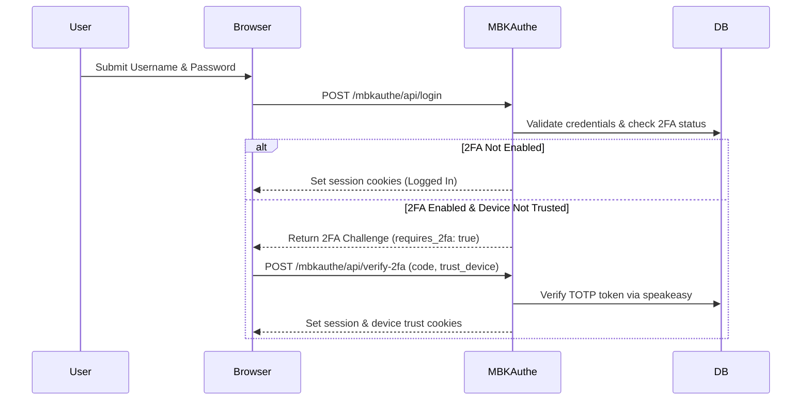

# Two-Factor Authentication (2FA) Guide

[Back to docs index](../README.md) | [Back to project README](../../README.md)

MBKAuthe provides robust **Two-Factor Authentication (2FA)** using Time-based One-Time Passwords (TOTP / RFC 6238), fully compatible with **Google Authenticator**, **Authy**, and **1Password**.

---

## 1. Enabling 2FA in Configuration

Enable two-factor authentication in your environment variables:

```env
MBKAUTH_TWO_FA_ENABLE=true
DEVICE_TRUST_DURATION_DAYS=7
```

- **`MBKAUTH_TWO_FA_ENABLE`**: When set to `true`, users with 2FA enabled will be prompted for their 6-digit TOTP code during login.
- **`DEVICE_TRUST_DURATION_DAYS`**: Number of days a verified device remains trusted, bypassing repeated 2FA challenges on subsequent logins from the same browser.

---

## 2. Authentication Workflow



---

## 3. Trusted Devices System

When a user checks *"Trust this device for 7 days"*, MBKAuthe generates a secure, cryptographically random token stored in the `mbkauthe_trusted_devices` table.

- Future logins from this browser check the trusted device cookie before challenging for 2FA.
- The trust token expires after `DEVICE_TRUST_DURATION_DAYS`.
- Changing password or revoking sessions automatically invalidates trusted device tokens.

---

## 4. API Endpoints for 2FA

| Endpoint | Method | Description |
| :--- | :--- | :--- |
| `/mbkauthe/api/verify-2fa` | `POST` | Validates submitted TOTP 6-digit token and completes login. |
| `/mbkauthe/api/setup-2fa` | `POST` | Generates a new TOTP secret seed and QR code data URI. |
| `/mbkauthe/api/confirm-2fa` | `POST` | Confirms initial setup with a valid code and activates 2FA. |
| `/mbkauthe/api/disable-2fa` | `POST` | Disables 2FA (requires password re-verification). |
