# MBKAuthe v6 Architecture & Data Flows

> Comprehensive architectural specifications, subsystem relationships, sequence flows, and downloadable diagram assets for the MBKAuthe authentication and authorization framework.

MBKAuthe v6 is architected around **defense-in-depth security**, **decoupled domain logic**, **dual-database persistence resilience**, and **provider-neutral identity federation**.

All diagram source files (`.mmd`) are located in [`docs/diagrams/mmd/`](../diagrams/mmd/) and vector SVG images are located in [`docs/diagrams/images/`](../diagrams/images/).

---

## 1. System Architecture Overview

MBKAuthe decouples the HTTP transport layer from the core domain services, cryptographic engines, and persistence adapters.

**Diagram Assets**: [Source (.mmd)](../diagrams/mmd/01-system-architecture.mmd) • [Vector SVG](../diagrams/images/01-system-architecture.svg)



```mermaid
flowchart TB
    subgraph ClientTier["Client / Consumer Tier"]
        Browser["Web Browser (SPA / SSR)"]
        Mobile["Mobile Application"]
        CLIClient["CLI Terminal Tool (RFC 8628)"]
        APIClient["API Client / Microservice (Bearer PAT)"]
    end

    subgraph HttpTier["HTTP & Express Middleware Layer (mbkauthe/middleware & express)"]
        SecHeaders["Security Headers & CORS"]
        CookieParser["Cookie Parser & Decryption (AES-256-GCM)"]
        RateLimiter["Rate Limiting Middleware"]
        AuthMiddleware["Session & Token Middleware (sessVal, authenticate)"]
        RBACMiddleware["RBAC / Permission Middleware (sessRole, sessPerm)"]
        Routers["Express Routers (/mbkauthe, /auth/oauth, /auth/cli, /mbkauthe/api/passkey)"]
    end

    subgraph CoreTier["Core Domain & Service Layer (mbkauthe/core & services)"]
        AuthCtx["AuthContext (Domain Entity)"]
        AuthService["AuthService (Session & Password)"]
        PasskeyService["PasskeyService (WebAuthn / FIDO2)"]
        OAuthService["OAuthFlowService (PKCE & OIDC)"]
        CliAuthService["CliAuthService (Device Flow)"]
        ApiTokenService["ApiTokenService (PAT Management)"]
        AuthzService["AuthorizationService (Policy Engine)"]
        RoleReg["RoleRegistry (In-Memory RBAC)"]
        PermSync["PermissionSyncService (Catalog Sync)"]
        EventBus["authEvents (Domain Event Emitter)"]
    end

    subgraph CryptoTier["Cryptographic & Security Subsystem (mbkauthe/config & core/tokens)"]
        PasswordHasher["Argon2id / PBKDF2 Password Hasher"]
        WebAuthnEngine["@simplewebauthn/server (FIDO2/WebAuthn)"]
        TokenEngine["TokenEngine (mbk_pat_, mbk_cli_, mbk_sess_)"]
        StateStore["OAuthStateStore (PKCE, State, Nonce)"]
        JoseVerifier["jose (OIDC JWKS Signature Verifier)"]
        AESCipher["AES-256-GCM Field & Cookie Encryptor"]
    end

    subgraph PersistenceTier["Dual-Database Persistence Engine (mbkauthe/db)"]
        Dialect["SQL Dialect Translator (Postgres $n <-> SQLite ?)"]
        QueryLogger["DbQueryLogger (In-Memory Audit Buffer)"]
        
        subgraph PostgresEngine["PostgreSQL Engine"]
            PGPool["Connection Pool (pg.Pool)"]
            PGRetry["Retry Wrapper (Exponential Backoff)"]
            PGAdapter["PostgresAdapter"]
        end

        subgraph SqliteEngine["SQLite Engine"]
            SqliteMutex["SqliteMutex (FIFO Queue Lock)"]
            SqliteWAL["better-sqlite3 (WAL Mode + Busy Timeout)"]
            SqliteAdapter["SqliteAdapter"]
        end

        Repos["Typed Repositories (UserRepository, SessionRepository, PasskeyRepository, OAuthAccountRepo, etc.)"]
    end

    Browser -->|HTTP + Encrypted Cookie| SecHeaders
    Mobile -->|HTTP + Bearer Token| SecHeaders
    CLIClient -->|Device Grant Polling| SecHeaders
    APIClient -->|HTTP + mbk_pat_ Token| SecHeaders

    SecHeaders --> RateLimiter --> CookieParser --> AuthMiddleware --> RBACMiddleware --> Routers

    Routers --> AuthService
    Routers --> PasskeyService
    Routers --> OAuthService
    Routers --> CliAuthService
    Routers --> ApiTokenService

    AuthMiddleware --> AuthCtx
    RBACMiddleware --> AuthzService
    AuthzService --> RoleReg

    AuthService --> PasswordHasher
    AuthService --> AESCipher
    PasskeyService --> WebAuthnEngine
    OAuthService --> StateStore
    OAuthService --> JoseVerifier
    OAuthService --> AESCipher
    ApiTokenService --> TokenEngine
    CliAuthService --> TokenEngine

    AuthService --> Repos
    PasskeyService --> Repos
    OAuthService --> Repos
    CliAuthService --> Repos
    ApiTokenService --> Repos
    PermSync --> Repos

    AuthService -.->|Emit Events| EventBus
    OAuthService -.->|Emit Events| EventBus
    CliAuthService -.->|Emit Events| EventBus

    Repos --> Dialect
    Dialect --> QueryLogger
    QueryLogger --> PGAdapter & SqliteAdapter

    PGAdapter --> PGRetry --> PGPool
    SqliteAdapter --> SqliteMutex --> SqliteWAL
```

---

## 2. Authentication & Session Lifecycle Flow

This sequence demonstrates standard credential authentication, password verification, session token generation, cookie encryption with fingerprinting, and concurrent session pruning.

**Diagram Assets**: [Source (.mmd)](../diagrams/mmd/02-auth-session-lifecycle.mmd) • [Vector SVG](../diagrams/images/02-auth-session-lifecycle.svg)

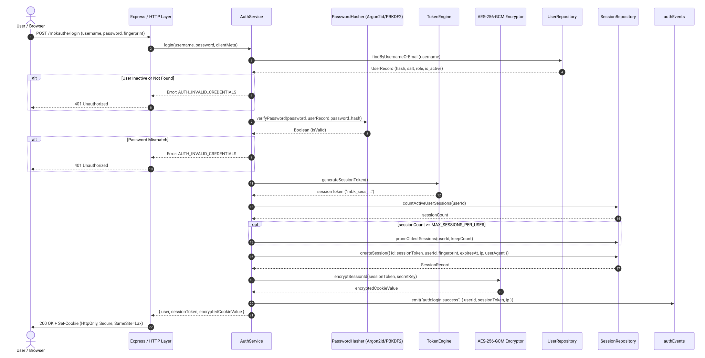

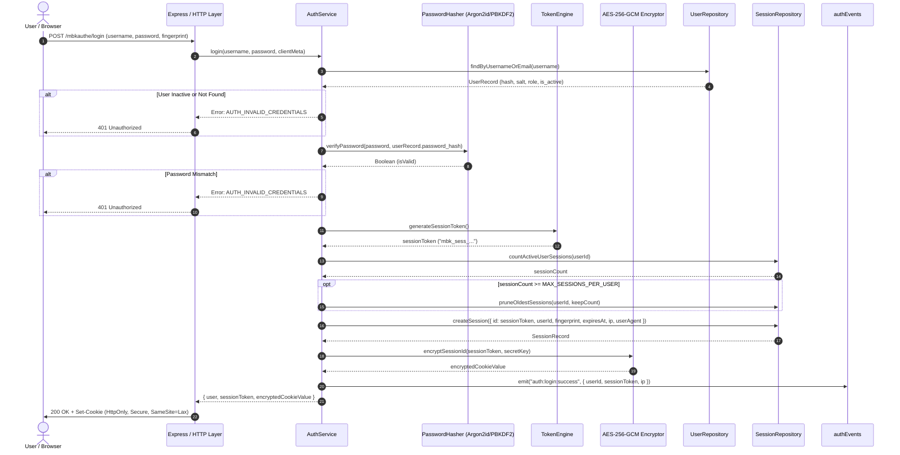
```mermaid
sequenceDiagram
    autonumber
    actor User as User / Browser
    participant Express as Express / HTTP Layer
    participant AuthService as AuthService
    participant Hasher as PasswordHasher (Argon2id/PBKDF2)
    participant TokenEngine as TokenEngine
    participant Cipher as AES-256-GCM Encryptor
    participant UserRepo as UserRepository
    participant SessRepo as SessionRepository
    participant EventBus as authEvents

    User->>Express: POST /mbkauthe/login (username, password, fingerprint)
    Express->>AuthService: login(username, password, clientMeta)
    AuthService->>UserRepo: findByUsernameOrEmail(username)
    UserRepo-->>AuthService: UserRecord (hash, salt, role, is_active)

    alt User Inactive or Not Found
        AuthService-->>Express: Error: AUTH_INVALID_CREDENTIALS
        Express-->>User: 401 Unauthorized
    end

    AuthService->>Hasher: verifyPassword(password, userRecord.password_hash)
    Hasher-->>AuthService: Boolean (isValid)

    alt Password Mismatch
        AuthService-->>Express: Error: AUTH_INVALID_CREDENTIALS
        Express-->>User: 401 Unauthorized
    end

    AuthService->>TokenEngine: generateSessionToken()
    TokenEngine-->>AuthService: sessionToken ("mbk_sess_...")

    AuthService->>SessRepo: countActiveUserSessions(userId)
    SessRepo-->>AuthService: sessionCount

    opt sessionCount >= MAX_SESSIONS_PER_USER
        AuthService->>SessRepo: pruneOldestSessions(userId, keepCount)
    end

    AuthService->>SessRepo: createSession({ id: sessionToken, userId, fingerprint, expiresAt, ip, userAgent })
    SessRepo-->>AuthService: SessionRecord

    AuthService->>Cipher: encryptSessionId(sessionToken, secretKey)
    Cipher-->>AuthService: encryptedCookieValue

    AuthService->>EventBus: emit("auth:login:success", { userId, sessionToken, ip })

    AuthService-->>Express: { user, sessionToken, encryptedCookieValue }
    Express->>User: 200 OK + Set-Cookie (HttpOnly, Secure, SameSite=Lax)
```

---

## 3. Session Validation & Request Authorization Pipeline

Every protected incoming request passes through a multi-stage validation pipeline that decodes credentials, reconstructs the `AuthContext`, and evaluates role and permission rules.

**Diagram Assets**: [Source (.mmd)](../diagrams/mmd/03-session-validation-pipeline.mmd) • [Vector SVG](../diagrams/images/03-session-validation-pipeline.svg)



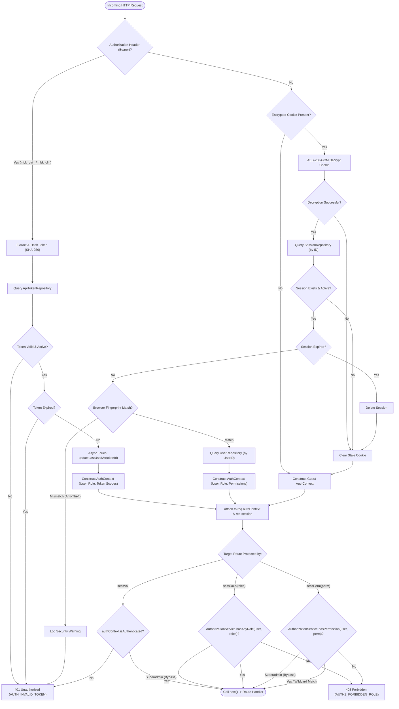
```mermaid
flowchart TD
    ReqStart(["Incoming HTTP Request"]) --> CheckHeader{"Authorization Header (Bearer)?"}

    %% Bearer Token Branch
    CheckHeader -- "Yes (mbk_pat_ / mbk_cli_)" --> VerifyBearer["Extract & Hash Token (SHA-256)"]
    VerifyBearer --> LookupToken["Query ApiTokenRepository"]
    LookupToken --> TokenValid{"Token Valid & Active?"}
    TokenValid -- "No" --> Ret401["401 Unauthorized (AUTH_INVALID_TOKEN)"]
    TokenValid -- "Yes" --> CheckTokenExpiry{"Token Expired?"}
    CheckTokenExpiry -- "Yes" --> Ret401
    CheckTokenExpiry -- "No" --> AsyncTouch["Async Touch: updateLastUsedAt(tokenId)"]
    AsyncTouch --> BuildTokenCtx["Construct AuthContext (User, Role, Token Scopes)"]

    %% Cookie Branch
    CheckHeader -- "No" --> CheckCookie{"Encrypted Cookie Present?"}
    CheckCookie -- "No" --> GuestCtx["Construct Guest AuthContext"]
    CheckCookie -- "Yes" --> DecryptCookie["AES-256-GCM Decrypt Cookie"]
    DecryptCookie --> DecryptSuccess{"Decryption Successful?"}
    DecryptSuccess -- "No" --> ClearCookie["Clear Stale Cookie"] --> GuestCtx
    DecryptSuccess -- "Yes" --> QuerySession["Query SessionRepository (by ID)"]
    QuerySession --> SessionFound{"Session Exists & Active?"}
    SessionFound -- "No" --> ClearCookie
    SessionFound -- "Yes" --> CheckSessExpiry{"Session Expired?"}
    CheckSessExpiry -- "Yes" --> ExpireSess["Delete Session"] --> ClearCookie
    CheckSessExpiry -- "No" --> CheckFingerprint{"Browser Fingerprint Match?"}
    CheckFingerprint -- "Mismatch (Anti-Theft)" --> LogTheft["Log Security Warning"] --> Ret401
    CheckFingerprint -- "Match" --> QueryUser["Query UserRepository (by UserID)"]
    QueryUser --> BuildUserCtx["Construct AuthContext (User, Role, Permissions)"]

    %% Middleware Evaluation
    BuildTokenCtx & BuildUserCtx & GuestCtx --> AttachCtx["Attach to req.authContext & req.session"]
    AttachCtx --> MiddlewareEval{"Target Route Protected by:"}

    %% Route Check Branches
    MiddlewareEval -- "sessVal" --> CheckIsAuth{"authContext.isAuthenticated?"}
    CheckIsAuth -- "No" --> Ret401
    CheckIsAuth -- "Yes" --> PassRoute(["Call next() -> Route Handler"])

    MiddlewareEval -- "sessRole(roles)" --> CheckRole{"AuthorizationService.hasAnyRole(user, roles)?"}
    CheckRole -- "No" --> Ret403["403 Forbidden (AUTHZ_FORBIDDEN_ROLE)"]
    CheckRole -- "Superadmin (Bypass)" --> PassRoute
    CheckRole -- "Yes" --> PassRoute

    MiddlewareEval -- "sessPerm(perm)" --> CheckPerm{"AuthorizationService.hasPermission(user, perm)?"}
    CheckPerm -- "No" --> Ret403
    CheckPerm -- "Superadmin (Bypass)" --> PassRoute
    CheckPerm -- "Yes / Wildcard Match" --> PassRoute
```

---

## 4. Provider-Neutral OAuth 2.0 & OIDC Flow (PKCE)

MBKAuthe includes a native, provider-neutral OAuth 2.0 and OIDC engine with automatic discovery, default-on PKCE (RFC 7636), cryptographic ID token verification (`jose` JWKS), and token encryption at rest.

**Diagram Assets**: [Source (.mmd)](../diagrams/mmd/04-oauth-oidc-pkce-flow.mmd) • [Vector SVG](../diagrams/images/04-oauth-oidc-pkce-flow.svg)

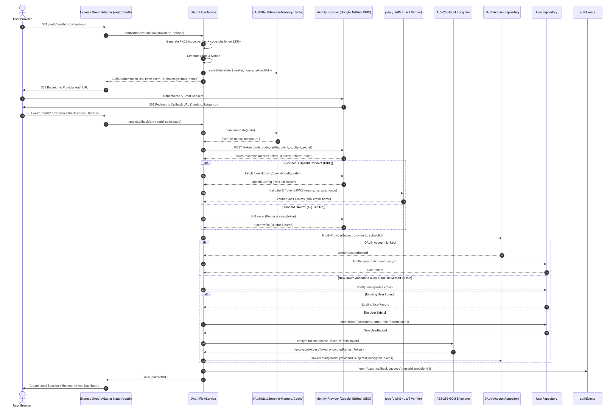

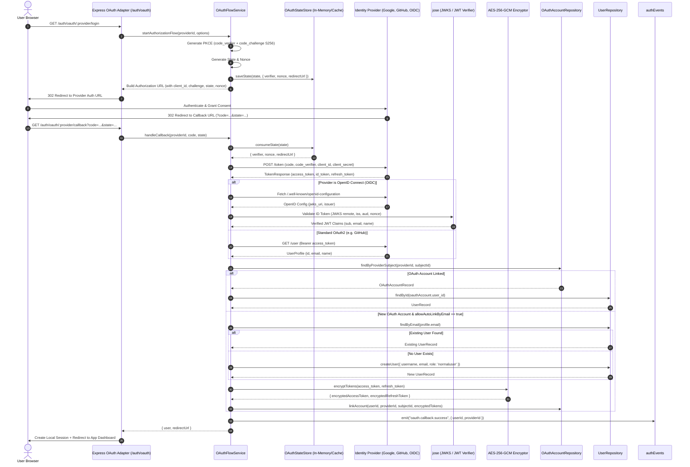
```mermaid
sequenceDiagram
    autonumber
    actor User as User Browser
    participant Express as Express OAuth Adapter (/auth/oauth)
    participant FlowService as OAuthFlowService
    participant StateStore as OAuthStateStore (In-Memory/Cache)
    participant Provider as Identity Provider (Google, GitHub, OIDC)
    participant Jose as jose (JWKS / JWT Verifier)
    participant Cipher as AES-256-GCM Encryptor
    participant OAuthRepo as OAuthAccountRepository
    participant UserRepo as UserRepository
    participant EventBus as authEvents

    User->>Express: GET /auth/oauth/:provider/login
    Express->>FlowService: startAuthorizationFlow(providerId, options)
    FlowService->>FlowService: Generate PKCE (code_verifier + code_challenge S256)
    FlowService->>FlowService: Generate State & Nonce
    FlowService->>StateStore: saveState(state, { verifier, nonce, redirectUrl })
    FlowService-->>Express: Build Authorization URL (with client_id, challenge, state, nonce)
    Express->>User: 302 Redirect to Provider Auth URL

    User->>Provider: Authenticate & Grant Consent
    Provider->>User: 302 Redirect to Callback URL (?code=...&state=...)
    User->>Express: GET /auth/oauth/:provider/callback?code=...&state=...

    Express->>FlowService: handleCallback(providerId, code, state)
    FlowService->>StateStore: consumeState(state)
    StateStore-->>FlowService: { verifier, nonce, redirectUrl }

    FlowService->>Provider: POST /token (code, code_verifier, client_id, client_secret)
    Provider-->>FlowService: TokenResponse (access_token, id_token, refresh_token)

    alt Provider is OpenID Connect (OIDC)
        FlowService->>Provider: Fetch /.well-known/openid-configuration
        Provider-->>FlowService: OpenID Config (jwks_uri, issuer)
        FlowService->>Jose: Validate ID Token (JWKS remote, iss, aud, nonce)
        Jose-->>FlowService: Verified JWT Claims (sub, email, name)
    else Standard OAuth2 (e.g. GitHub)
        FlowService->>Provider: GET /user (Bearer access_token)
        Provider-->>FlowService: UserProfile (id, email, name)
    end

    FlowService->>OAuthRepo: findByProviderSubject(providerId, subjectId)

    alt OAuth Account Linked
        OAuthRepo-->>FlowService: OAuthAccountRecord
        FlowService->>UserRepo: findById(oauthAccount.user_id)
        UserRepo-->>FlowService: UserRecord
    else New OAuth Account & allowAutoLinkByEmail == true
        FlowService->>UserRepo: findByEmail(profile.email)
        alt Existing User Found
            UserRepo-->>FlowService: Existing UserRecord
        else No User Exists
            FlowService->>UserRepo: createUser({ username, email, role: 'normaluser' })
            UserRepo-->>FlowService: New UserRecord
        end
        FlowService->>Cipher: encryptTokens(access_token, refresh_token)
        Cipher-->>FlowService: { encryptedAccessToken, encryptedRefreshToken }
        FlowService->>OAuthRepo: linkAccount(userId, providerId, subjectId, encryptedTokens)
    end

    FlowService->>EventBus: emit("oauth.callback.success", { userId, providerId })
    FlowService-->>Express: { user, redirectUrl }
    Express->>User: Create Local Session + Redirect to App Dashboard
```

---

## 5. Dynamic RBAC & Permission Catalog Synchronization Flow

Permissions are defined declaratively in application code and synchronized to the database at startup, allowing dynamic role assignments and zero-downtime policy updates.

**Diagram Assets**: [Source (.mmd)](../diagrams/mmd/05-rbac-permission-sync.mmd) • [Vector SVG](../diagrams/images/05-rbac-permission-sync.svg)



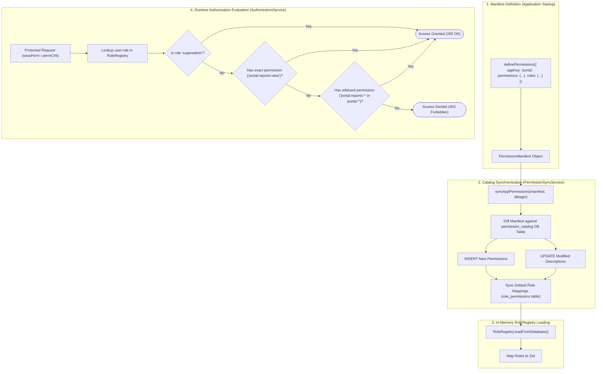
```mermaid
flowchart TD
    subgraph DevTime["1. Manifest Definition (Application Startup)"]
        DefCode["definePermissions({ appKey: 'portal', permissions: {...}, roles: {...} })"]
        ManifestObj["PermissionManifest Object"]
        DefCode --> ManifestObj
    end

    subgraph SyncEngine["2. Catalog Synchronization (PermissionSyncService)"]
        SyncCall["syncAppPermissions(manifest, dblogin)"]
        DiffEngine["Diff Manifest against permission_catalog DB Table"]
        InsertPerms["INSERT New Permissions"]
        UpdatePerms["UPDATE Modified Descriptions"]
        SyncRoles["Sync Default Role Mappings (role_permissions table)"]
        
        SyncCall --> DiffEngine
        DiffEngine --> InsertPerms & UpdatePerms --> SyncRoles
    end

    subgraph MemorySync["3. In-Memory RoleRegistry Loading"]
        LoadRegistry["RoleRegistry.loadFromDatabase()"]
        PopulateMap["Map Roles to Set<PermissionStrings>"]
        
        SyncRoles --> LoadRegistry --> PopulateMap
    end

    subgraph RuntimeAuthz["4. Runtime Authorization Evaluation (AuthorizationService)"]
        IncomingReq["Protected Request (sessPerm / permChk)"]
        CheckUserRole["Lookup user.role in RoleRegistry"]
        
        SuperCheck{"Is role 'superadmin'?"}
        ExactCheck{"Has exact permission ('portal:reports:view')?"}
        WildcardCheck{"Has wildcard permission ('portal:reports:*' or 'portal:*')?"}
        
        IncomingReq --> CheckUserRole --> SuperCheck
        SuperCheck -- "Yes" --> Allow(["Access Granted (200 OK)"])
        SuperCheck -- "No" --> ExactCheck
        ExactCheck -- "Yes" --> Allow
        ExactCheck -- "No" --> WildcardCheck
        WildcardCheck -- "Yes" --> Allow
        WildcardCheck -- "No" --> Deny(["Access Denied (403 Forbidden)"])
    end

    ManifestObj --> SyncCall
```

---

## 6. Personal Access Token (PAT) Verification Flow

Personal Access Tokens are cryptographically generated with explicit prefixes (`mbk_pat_`), stored as SHA-256 hashes, and verified in constant time.

**Diagram Assets**: [Source (.mmd)](../diagrams/mmd/06-api-token-verification.mmd) • [Vector SVG](../diagrams/images/06-api-token-verification.svg)

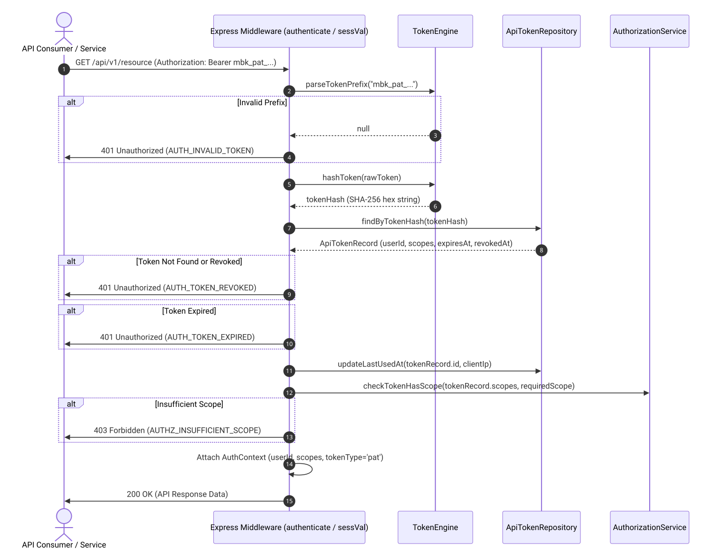

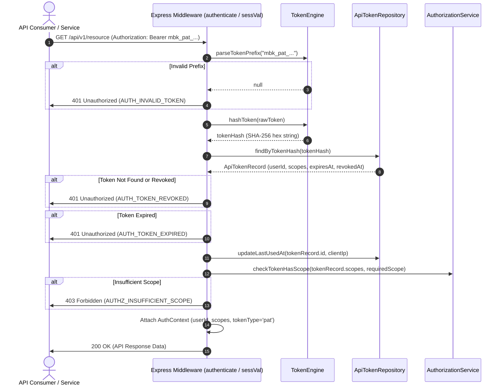
```mermaid
sequenceDiagram
    autonumber
    actor Client as API Consumer / Service
    participant Express as Express Middleware (authenticate / sessVal)
    participant TokenEngine as TokenEngine
    participant ApiTokenRepo as ApiTokenRepository
    participant AuthzService as AuthorizationService

    Client->>Express: GET /api/v1/resource (Authorization: Bearer mbk_pat_...)
    Express->>TokenEngine: parseTokenPrefix("mbk_pat_...")
    
    alt Invalid Prefix
        TokenEngine-->>Express: null
        Express->>Client: 401 Unauthorized (AUTH_INVALID_TOKEN)
    end

    Express->>TokenEngine: hashToken(rawToken)
    TokenEngine-->>Express: tokenHash (SHA-256 hex string)

    Express->>ApiTokenRepo: findByTokenHash(tokenHash)
    ApiTokenRepo-->>Express: ApiTokenRecord (userId, scopes, expiresAt, revokedAt)

    alt Token Not Found or Revoked
        Express->>Client: 401 Unauthorized (AUTH_TOKEN_REVOKED)
    end

    alt Token Expired
        Express->>Client: 401 Unauthorized (AUTH_TOKEN_EXPIRED)
    end

    Express->>ApiTokenRepo: updateLastUsedAt(tokenRecord.id, clientIp)
    
    Express->>AuthzService: checkTokenHasScope(tokenRecord.scopes, requiredScope)
    alt Insufficient Scope
        Express->>Client: 403 Forbidden (AUTHZ_INSUFFICIENT_SCOPE)
    end

    Express->>Express: Attach AuthContext (userId, scopes, tokenType='pat')
    Express->>Client: 200 OK (API Response Data)
```

---

## 7. RFC 8628 CLI Device Authorization Grant Flow

Allows terminal utilities and development CLI tools to authenticate through the browser without embedding client credentials.

**Diagram Assets**: [Source (.mmd)](../diagrams/mmd/07-cli-device-auth-grant.mmd) • [Vector SVG](../diagrams/images/07-cli-device-auth-grant.svg)

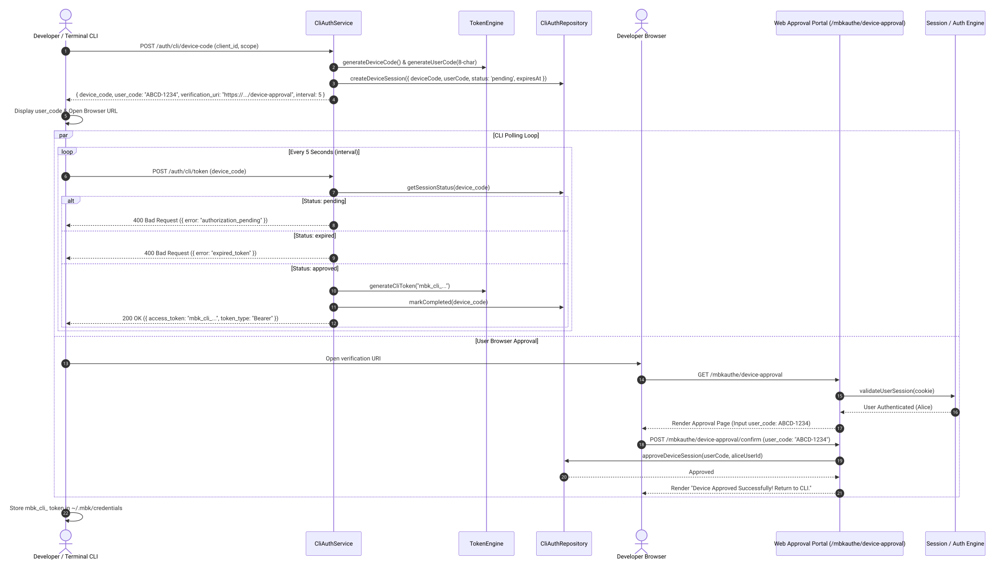

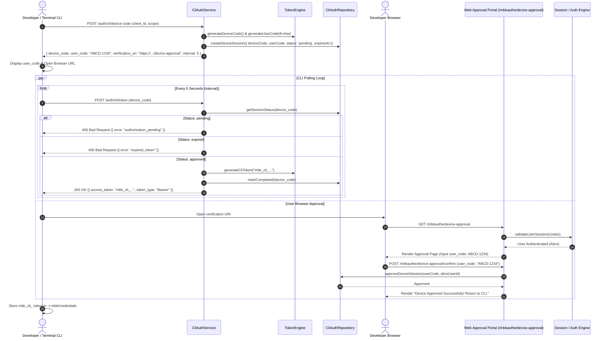
```mermaid
sequenceDiagram
    autonumber
    actor Developer as Developer / Terminal CLI
    participant CliService as CliAuthService
    participant TokenEngine as TokenEngine
    participant CliRepo as CliAuthRepository
    actor Browser as Developer Browser
    participant Express as Web Approval Portal (/mbkauthe/device-approval)
    participant SessService as Session / Auth Engine

    Developer->>CliService: POST /auth/cli/device-code (client_id, scope)
    CliService->>TokenEngine: generateDeviceCode() & generateUserCode(8-char)
    CliService->>CliRepo: createDeviceSession({ deviceCode, userCode, status: 'pending', expiresAt })
    CliService-->>Developer: { device_code, user_code: "ABCD-1234", verification_uri: "https://.../device-approval", interval: 5 }

    Developer->>Developer: Display user_code & Open Browser URL
    
    par CLI Polling Loop
        loop Every 5 Seconds (interval)
            Developer->>CliService: POST /auth/cli/token (device_code)
            CliService->>CliRepo: getSessionStatus(device_code)
            alt Status: pending
                CliService-->>Developer: 400 Bad Request ({ error: "authorization_pending" })
            else Status: expired
                CliService-->>Developer: 400 Bad Request ({ error: "expired_token" })
            else Status: approved
                CliService->>TokenEngine: generateCliToken("mbk_cli_...")
                CliService->>CliRepo: markCompleted(device_code)
                CliService-->>Developer: 200 OK ({ access_token: "mbk_cli_...", token_type: "Bearer" })
            end
        end
    and User Browser Approval
        Developer->>Browser: Open verification URI
        Browser->>Express: GET /mbkauthe/device-approval
        Express->>SessService: validateUserSession(cookie)
        SessService-->>Express: User Authenticated (Alice)
        Express-->>Browser: Render Approval Page (Input user_code: ABCD-1234)
        Browser->>Express: POST /mbkauthe/device-approval/confirm (user_code: "ABCD-1234")
        Express->>CliRepo: approveDeviceSession(userCode, aliceUserId)
        CliRepo-->>Express: Approved
        Express-->>Browser: Render "Device Approved Successfully! Return to CLI."
    end

    Developer->>Developer: Store mbk_cli_ token in ~/.mbk/credentials
```

---

## 8. Dual-Database Resilient Persistence Flow

MBKAuthe standardizes database interactions through a dialect translation abstraction, protecting PostgreSQL with transparent retries and SQLite with a FIFO write mutex.

**Diagram Assets**: [Source (.mmd)](../diagrams/mmd/08-dual-database-resilience.mmd) • [Vector SVG](../diagrams/images/08-dual-database-resilience.svg)



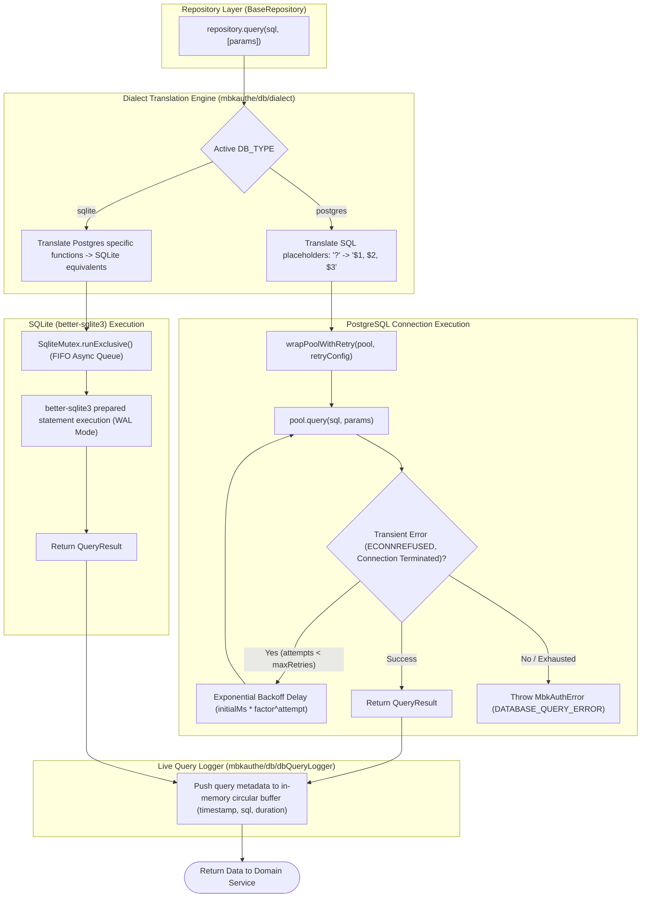
```mermaid
flowchart TD
    subgraph RepoLayer["Repository Layer (BaseRepository)"]
        QueryCall["repository.query(sql, [params])"]
    end

    subgraph DialectLayer["Dialect Translation Engine (mbkauthe/db/dialect)"]
        DetectDialect{"Active DB_TYPE"}
        ConvertPG["Translate SQL placeholders: '?' -> '$1, $2, $3'"]
        ConvertSqlite["Translate Postgres specific functions -> SQLite equivalents"]
        
        QueryCall --> DetectDialect
        DetectDialect -- "postgres" --> ConvertPG
        DetectDialect -- "sqlite" --> ConvertSqlite
    end

    subgraph LoggingLayer["Live Query Logger (mbkauthe/db/dbQueryLogger)"]
        LogBuffer["Push query metadata to in-memory circular buffer (timestamp, sql, duration)"]
    end

    subgraph PostgresBranch["PostgreSQL Connection Execution"]
        PGWrap["wrapPoolWithRetry(pool, retryConfig)"]
        PGExec["pool.query(sql, params)"]
        PGError{"Transient Error (ECONNREFUSED, Connection Terminated)?"}
        PGBackoff["Exponential Backoff Delay (initialMs * factor^attempt)"]
        PGSuccess["Return QueryResult"]

        ConvertPG --> PGWrap --> PGExec
        PGExec --> PGError
        PGError -- "Yes (attempts < maxRetries)" --> PGBackoff --> PGExec
        PGError -- "No / Exhausted" --> ThrowDBError["Throw MbkAuthError (DATABASE_QUERY_ERROR)"]
        PGError -- "Success" --> PGSuccess
    end

    subgraph SqliteBranch["SQLite (better-sqlite3) Execution"]
        MutexQueue["SqliteMutex.runExclusive() (FIFO Async Queue)"]
        WALExecution["better-sqlite3 prepared statement execution (WAL Mode)"]
        SqliteSuccess["Return QueryResult"]

        ConvertSqlite --> MutexQueue --> WALExecution --> SqliteSuccess
    end

    PGSuccess & SqliteSuccess --> LogBuffer
    LogBuffer --> ReturnData(["Return Data to Domain Service"])
```

---

## 9. Observability, Health Diagnostics & Domain Event Flow

MBKAuthe includes an integrated domain event streaming engine (`authEvents`) and real-time health diagnostic checks.

**Diagram Assets**: [Source (.mmd)](../diagrams/mmd/09-observability-events-health.mmd) • [Vector SVG](../diagrams/images/09-observability-events-health.svg)



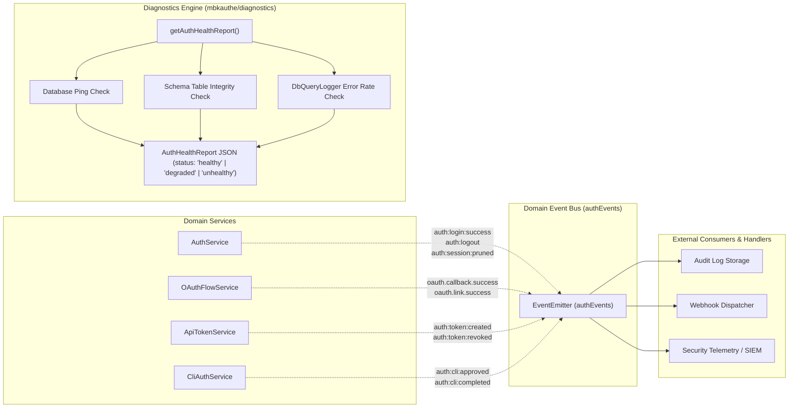
```mermaid
flowchart LR
    subgraph CoreServices["Domain Services"]
        AuthSvc["AuthService"]
        OAuthSvc["OAuthFlowService"]
        TokenSvc["ApiTokenService"]
        CliSvc["CliAuthService"]
    end

    subgraph EventStream["Domain Event Bus (authEvents)"]
        Emitter["EventEmitter (authEvents)"]
        
        AuthSvc -.->|"auth:login:success\nauth:logout\nauth:session:pruned"| Emitter
        OAuthSvc -.->|"oauth.callback.success\noauth.link.success"| Emitter
        TokenSvc -.->|"auth:token:created\nauth:token:revoked"| Emitter
        CliSvc -.->|"auth:cli:approved\nauth:cli:completed"| Emitter
    end

    subgraph EventSubscribers["External Consumers & Handlers"]
        AuditLog["Audit Log Storage"]
        Webhooks["Webhook Dispatcher"]
        Analytics["Security Telemetry / SIEM"]
    end

    Emitter --> AuditLog
    Emitter --> Webhooks
    Emitter --> Analytics

    subgraph Diagnostics["Diagnostics Engine (mbkauthe/diagnostics)"]
        HealthFunc["getAuthHealthReport()"]
        DBPing["Database Ping Check"]
        TableCheck["Schema Table Integrity Check"]
        LoggerCheck["DbQueryLogger Error Rate Check"]

        HealthFunc --> DBPing & TableCheck & LoggerCheck
        DBPing & TableCheck & LoggerCheck --> HealthReport["AuthHealthReport JSON (status: 'healthy' | 'degraded' | 'unhealthy')"]
    end
```

---

## 10. WebAuthn / FIDO2 Passkey Ceremonies

MBKAuthe v6 natively implements FIDO2 WebAuthn registration and authentication ceremonies powered by `@simplewebauthn/server`.

**Diagram Assets**: [Source (.mmd)](../diagrams/mmd/10-passkey-webauthn-ceremonies.mmd)

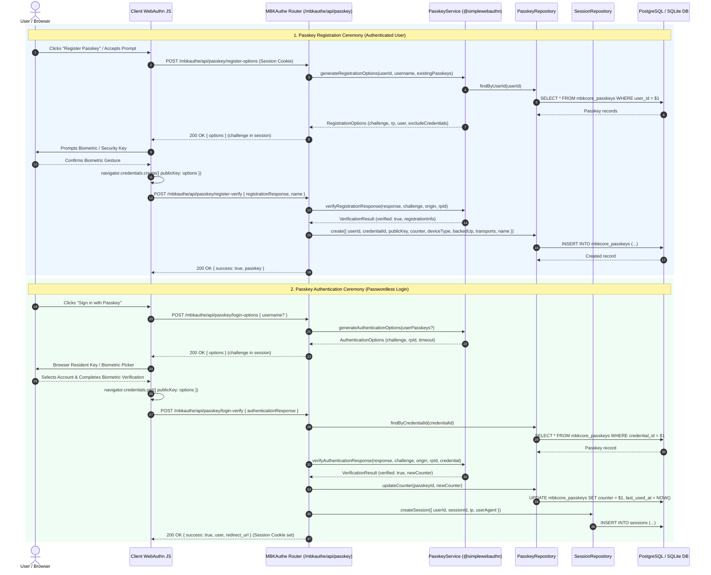
```mermaid
sequenceDiagram
    autonumber
    actor User as User / Browser
    participant ClientJS as Client WebAuthn JS
    participant Express as MBKAuthe Router (/mbkauthe/api/passkey)
    participant PasskeySvc as PasskeyService (@simplewebauthn)
    participant PasskeyRepo as PasskeyRepository
    participant SessionRepo as SessionRepository
    participant DB as PostgreSQL / SQLite DB

    rect rgb(238, 246, 255)
        note over User, DB: 1. Passkey Registration Ceremony (Authenticated User)
        User->>ClientJS: Clicks "Register Passkey" / Accepts Prompt
        ClientJS->>Express: POST /mbkauthe/api/passkey/register-options (Session Cookie)
        Express->>PasskeySvc: generateRegistrationOptions(userId, username, existingPasskeys)
        PasskeySvc->>PasskeyRepo: findByUserId(userId)
        PasskeyRepo->>DB: SELECT * FROM mbkcore_passkeys WHERE user_id = $1
        DB-->>PasskeyRepo: Passkey records
        PasskeySvc-->>Express: RegistrationOptions (challenge, rp, user, excludeCredentials)
        Express-->>ClientJS: 200 OK { options } (challenge in session)
        
        ClientJS->>User: Prompts Biometric / Security Key
        User-->>ClientJS: Confirms Biometric Gesture
        ClientJS->>ClientJS: navigator.credentials.create({ publicKey: options })
        ClientJS->>Express: POST /mbkauthe/api/passkey/register-verify { registrationResponse, name }
        Express->>PasskeySvc: verifyRegistrationResponse(response, challenge, origin, rpId)
        PasskeySvc-->>Express: VerificationResult (verified: true, registrationInfo)
        Express->>PasskeyRepo: create({ userId, credentialId, publicKey, counter, deviceType, backedUp, transports, name })
        PasskeyRepo->>DB: INSERT INTO mbkcore_passkeys (...)
        DB-->>PasskeyRepo: Created record
        Express-->>ClientJS: 200 OK { success: true, passkey }
    end

    rect rgb(240, 253, 244)
        note over User, DB: 2. Passkey Authentication Ceremony (Passwordless Login)
        User->>ClientJS: Clicks "Sign in with Passkey"
        ClientJS->>Express: POST /mbkauthe/api/passkey/login-options { username? }
        Express->>PasskeySvc: generateAuthenticationOptions(userPasskeys?)
        PasskeySvc-->>Express: AuthenticationOptions (challenge, rpId, timeout)
        Express-->>ClientJS: 200 OK { options } (challenge in session)

        ClientJS->>User: Browser Resident Key / Biometric Picker
        User-->>ClientJS: Selects Account & Completes Biometric Verification
        ClientJS->>ClientJS: navigator.credentials.get({ publicKey: options })
        ClientJS->>Express: POST /mbkauthe/api/passkey/login-verify { authenticationResponse }
        Express->>PasskeyRepo: findByCredentialId(credentialId)
        PasskeyRepo->>DB: SELECT * FROM mbkcore_passkeys WHERE credential_id = $1
        DB-->>PasskeyRepo: Passkey record
        Express->>PasskeySvc: verifyAuthenticationResponse(response, challenge, origin, rpId, credential)
        PasskeySvc-->>Express: VerificationResult (verified: true, newCounter)
        Express->>PasskeyRepo: updateCounter(passkeyId, newCounter)
        PasskeyRepo->>DB: UPDATE mbkcore_passkeys SET counter = $1, last_used_at = NOW()
        Express->>SessionRepo: createSession({ userId, sessionId, ip, userAgent })
        SessionRepo->>DB: INSERT INTO sessions (...)
        Express-->>ClientJS: 200 OK { success: true, user, redirect_url } (Session Cookie set)
    end
```

---

## Next Steps & Related Documentation

- [Getting Started & Installation](getting-started.md)
- [WebAuthn & Passkeys Guide](passkeys.md)
- [Dual-Database Architecture & Repositories](dual-database-guide.md)
- [Provider-Neutral OAuth & OIDC](oauth.md)
- [Dynamic Permission Catalogs](permissions.md)
- [API Reference Catalog](../reference/api.md)
