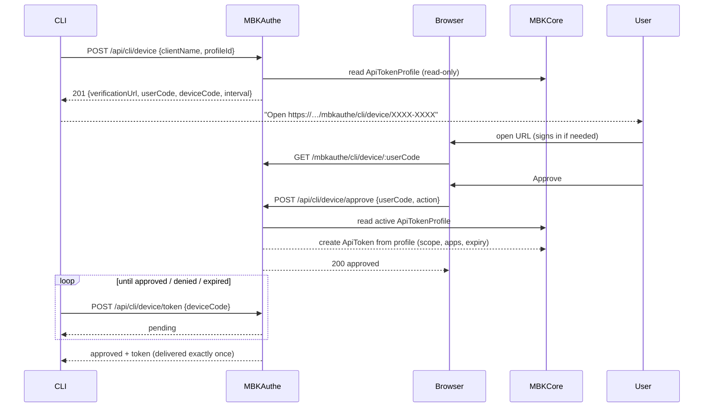

# Browser-based CLI Authentication (Device Flow)

[Back to guides index](../README.md) | [Back to project README](../../README.md)

MBKAuthe implements an RFC 8628-style **device authorization flow** that lets
CLI tools authenticate a user in a browser without ever asking for credentials
in the terminal — the same UX as `gh auth login` or `az login`.

The key difference from a stock device flow is **customized token
provisioning**: instead of a client picking permissions itself, the CLI
references an **API Token Profile** (a predefined template managed by MBKCore).
MBKAuthe builds the issued API token from that template.

## Flow



## Configuration

### Mounting

The CLI device-flow router is attached to MBKAuthe's **main router by default**,
so host apps do not need to mount `cliAuthRouter` themselves. The endpoints
below are served at the host root (`/api/cli/device`, `/mbkauthe/cli/device/…`).

To disable it:

```jsonc
// mbkautheVar
{
  "APP_NAME": "mbkauthe",
  "CLI_AUTH_ENABLED": "false"
}
```

`CLI_AUTH_ENABLED` accepts `"true"` (default) / `"false"` / `"f"`.

### Verification URL

The verification URL shown to the user is built from, in order of priority:

1. `CLI_AUTH_BASE_URL` — an absolute base URL (no trailing slash), e.g.
   `"https://portal.mbktech.org"`. Recommended for production so CLIs always get
   a reachable public URL regardless of the request's host header.
2. `https://<DOMAIN>` when `IS_DEPLOYED` is `true`.
3. The incoming request's protocol + host (dev default).

Example:

```jsonc
// mbkautheVar
{
  "APP_NAME": "mbkauthe",
  "DOMAIN": "mbktech.org",
  "IS_DEPLOYED": "true",
  "CLI_AUTH_BASE_URL": "https://portal.mbktech.org",
  "CLI_AUTH_ENABLED": "true"
}
```

## Endpoints

### 1. Start a login — `POST /api/cli/device`

Called by the CLI. Public, rate-limited (20/min/IP).

The profile can be referenced by its **`profileKey`** (a random ≥6-char unique
id, preferred) or its numeric serial **`profileId`** (backwards compatible).

```bash
curl -X POST https://portal.mbktech.org/api/cli/device \
  -H "Content-Type: application/json" \
  -d '{"clientName": "my-cli", "profileKey": "1362403658a3"}'
```

Response `201`:

```json
{
  "success": true,
  "verificationUrl": "https://portal.mbktech.org/mbkauthe/cli/device/XXXX-XXXX",
  "userCode": "XXXX-XXXX",
  "deviceCode": "a3f9…(48 hex chars, secret)",
  "expiresIn": 900,
  "interval": 5,
  "clientName": "my-cli",
  "profile": {
    "id": 3,
    "key": "1362403658a3",
    "name": "cli-default",
    "scope": "read-only",
    "allowedApps": ["Portal", "mbkauthe"],
    "expiresInDays": 30
  }
}
```

Errors: `400` for a missing `clientName` or an invalid/inactive
`profileKey`/`profileId`.

### 2. Browser approval page — `GET /mbkauthe/cli/device/:userCode`

Opened by the user. Requires an authenticated session; if not logged in, the
user is redirected to `/mbkauthe/login?redirect=…` and returned here after
signing in. Shows the requesting client, the token profile details, and
**Approve** / **Deny** buttons.

### 3. Approve / deny — `POST /api/cli/device/approve`

Session-authenticated (rate-limited 30/min/IP). Called by the approval page.

```json
{ "userCode": "XXXX-XXXX", "action": "approve" }
```

On approval MBKAuthe:

1. Reads the **active** API Token Profile for `ProfileId` (MBKCore-owned).
2. Creates an API token from that template — scope, allowed applications, and
   expiration all come from the profile.
3. Stages the raw token and marks the session `approved`.

Response `200`:

```json
{ "success": true, "status": "approved", "message": "Login approved. The CLI will receive the token momentarily." }
```

### 4. Poll for the token — `POST /api/cli/device/token`

Called by the CLI on `interval` seconds. Public, rate-limited (60/min/IP).

```bash
curl -X POST https://portal.mbktech.org/api/cli/device/token \
  -H "Content-Type: application/json" \
  -d '{"deviceCode": "a3f9…"}'
```

Possible responses:

| Status | Meaning |
| --- | --- |
| `pending` | User hasn't decided yet — poll again after `interval` seconds |
| `approved` | Includes `token` (the raw `mbk_…` API token). **Delivered once.** |
| `completed` | The token was already delivered to an earlier poll |
| `denied` | The user denied the request |
| `expired` | The 15-minute window elapsed before approval |
| `invalid` (`404`) | Unknown device code |

```json
{ "success": true, "status": "approved", "token": "mbk_…", "tokenPrefix": "mbk_1234", "username": "jane", "message": "Login approved" }
```

## CLI client example

A minimal polling loop:

```javascript
// 1. Start
const start = await fetch(`${BASE}/api/cli/device`, {
  method: "POST",
  headers: { "Content-Type": "application/json" },
  body: JSON.stringify({ clientName: "my-cli", profileId }),
}).then((r) => r.json());

console.log(`Open: ${start.verificationUrl}`);

// 2. Poll
for (;;) {
  await sleep(start.interval * 1000);
  const res = await fetch(`${BASE}/api/cli/device/token`, {
    method: "POST",
    headers: { "Content-Type": "application/json" },
    body: JSON.stringify({ deviceCode: start.deviceCode }),
  }).then((r) => r.json());

  if (res.status === "approved") {
    console.log(`Authenticated as ${res.username}. Token: ${res.token}`);
    break;
  }
  if (["denied", "expired", "completed", "invalid"].includes(res.status)) {
    throw new Error(`Login ${res.status}`);
  }
}
```

## Managing API Token Profiles

API Token Profiles are **managed by MBKCore** (admin CRUD at
`/dashboard/admin/api-token-profiles`). MBKAuthe only **consumes** them at
token-issuance time — it never creates or edits profiles. See the MBKCore docs
for profile management.

## Security notes

- **Device codes** are high-entropy secrets; only their SHA-256 hash is stored.
  The raw token is staged in `PendingToken` only between approval and the CLI's
  next poll, then cleared on delivery.
- **Single delivery**: pollers race for the token via an atomic
  `pending -> approved -> completed` transition, so a token can never be
  returned to two different polls.
- **User codes** are short and single-use; only their hash is stored.
- The approve endpoint is a same-origin JSON POST; cross-site requests are
  blocked by CORS + `SameSite=Lax` cookies (consistent with `POST /api/token`).
- Sessions expire after 15 minutes (`DEVICE_CODE_TTL_MS` in `lib/routes/cliAuth.js`).
