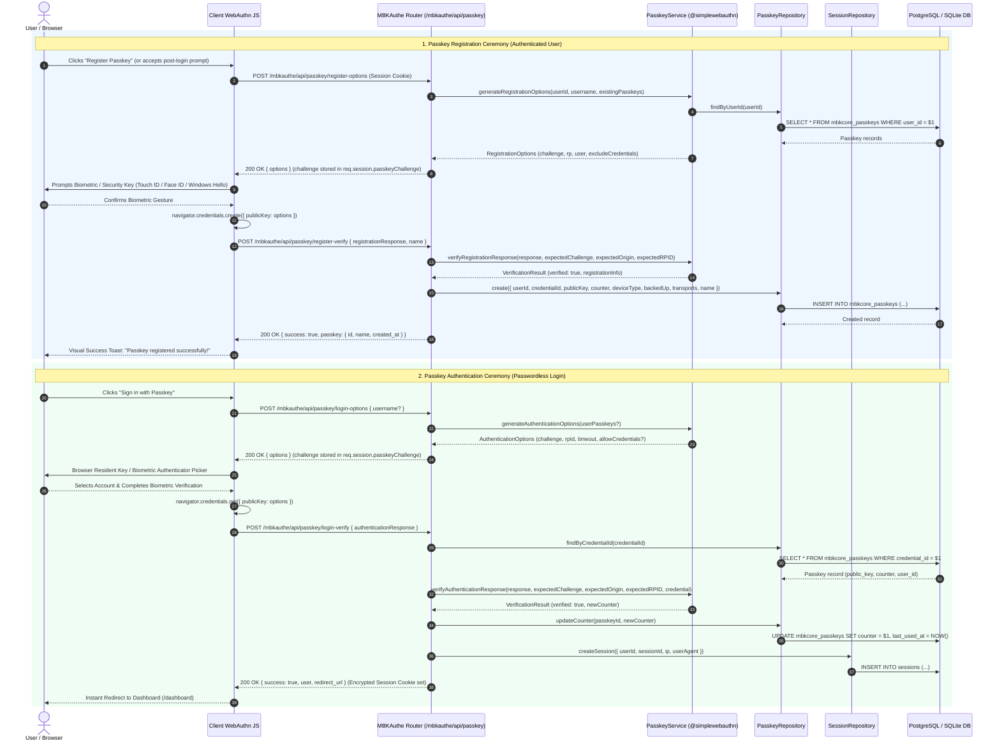

# WebAuthn & Passkeys in MBKAuthe v6

> Complete architectural specifications, registration and authentication ceremonies, multi-user support, and management APIs for WebAuthn / FIDO2 Passkeys.

MBKAuthe v6 features native **WebAuthn / FIDO2 Passkey** support powered by `@simplewebauthn/server`. Passkeys allow users to sign in seamlessly using platform biometrics (Touch ID, Face ID, Windows Hello) or roaming hardware security keys (YubiKeys), providing phishing-resistant passwordless authentication.

---

## 1. Architecture Overview

Passkeys in MBKAuthe are completely integrated into the core authentication, session engine, and database persistence layers:

```
┌─────────────────────────────────────────────────────────────┐
│                      Client / Browser                       │
│  - navigator.credentials.create() (Registration)           │
│  - navigator.credentials.get() (Authentication)             │
│  - Post-Login "Save Passkey" Promotion Modal                │
└──────────────────────────────┬──────────────────────────────┘
                               │ HTTP JSON API
                               ▼
┌─────────────────────────────────────────────────────────────┐
│             MBKAuthe Router (/mbkauthe/api/passkey)         │
│  - POST /register-options    - POST /register-verify        │
│  - POST /login-options       - POST /login-verify           │
│  - GET  /list                - PATCH /:id                   │
│  - DELETE /:id                                              │
└──────────────┬───────────────────────────────┬──────────────┘
               │                               │
               ▼                               ▼
┌──────────────────────────────┐ ┌────────────────────────────┐
│      @simplewebauthn/server   │ │      PasskeyRepository     │
│  - generateRegistrationOpts  │ │  - findByUserId()          │
│  - verifyRegistrationResp    │ │  - findByCredentialId()    │
│  - generateAuthenticationOpts│ │  - create()                │
│  - verifyAuthenticationResp  │ │  - updateCounter()         │
└──────────────────────────────┘ └─────────────┬──────────────┘
                                               │
                                               ▼
                                 ┌────────────────────────────┐
                                 │ PostgreSQL / SQLite DB     │
                                 │ (table: mbkcore_passkeys)  │
                                 └────────────────────────────┘
```

---

## 2. Sequence Ceremonies

**Diagram Assets**: [Source (.mmd)](../diagrams/mmd/10-passkey-webauthn-ceremonies.mmd)



---

## 3. Multiple Users on the Same Device

Passkeys support multiple accounts on the same computer, phone, or security key through **Discoverable Credentials** (Resident Keys):

1. **Unique User IDs**: During registration, MBKAuthe converts each user's unique database ID into a distinct binary buffer.
2. **Resident Key Storage**: The platform authenticator (e.g. Apple iCloud Keychain, Windows Hello, Google Password Manager, 1Password) binds the credential directly to the Relying Party domain (`DOMAIN`) and the user identity.
3. **Authenticator Picker**: When a user triggers "Sign in with Passkey", the browser automatically displays an account picker showing all passkeys registered on that device for the domain. Selecting the desired identity completes authentication in a single biometric touch.

---

## 4. Post-Login Registration Prompt

To accelerate passkey adoption without disrupting standard password or OAuth sign-ins, applications can present a post-login prompt modal:

```
┌─────────────────────────────────────────────────────────────┐
│ 🔐 Enable Instant Biometric Sign-in?                       │
│                                                             │
│ Would you like to save a passkey on this device for         │
│ fast, passwordless login next time?                         │
│                                                             │
│ [Don't show again]                [Not now]   [Save Passkey] │
└─────────────────────────────────────────────────────────────┘
```

- **Save Passkey**: Triggers the standard `register-options` -> `navigator.credentials.create` -> `register-verify` flow in the background before redirecting.
- **Not now**: Skips registration and proceeds to the redirect destination.
- **Don't show again**: Persists a client preference (e.g. `localStorage.setItem('mbk_passkey_prompt_dismissed', 'true')`) and immediately redirects.

---

## 5. API Reference

All passkey endpoints are mounted under `/mbkauthe/api/passkey`:

| Method | Endpoint | Description | Auth Required |
|---|---|---|---|
| `POST` | `/mbkauthe/api/passkey/register-options` | Generates WebAuthn registration challenge & user entity | Session Cookie |
| `POST` | `/mbkauthe/api/passkey/register-verify` | Validates attestation response & stores public key | Session Cookie |
| `POST` | `/mbkauthe/api/passkey/login-options` | Generates WebAuthn assertion challenge | Public |
| `POST` | `/mbkauthe/api/passkey/login-verify` | Verifies assertion signature, updates counter, creates session | Public |
| `GET` | `/mbkauthe/api/passkey/list` | Lists all registered passkeys for active user | Session Cookie |
| `PATCH` | `/mbkauthe/api/passkey/:id` | Renames a registered passkey | Session Cookie |
| `DELETE` | `/mbkauthe/api/passkey/:id` | Deletes a passkey | Session Cookie |

---

## 6. Database Schema (`mbkcore_passkeys`)

Passkey credentials are persisted in the `mbkcore_passkeys` table across both PostgreSQL and SQLite:

### PostgreSQL DDL:
```sql
CREATE TABLE IF NOT EXISTS mbkcore_passkeys (
    id SERIAL PRIMARY KEY,
    user_id INTEGER NOT NULL REFERENCES users(id) ON DELETE CASCADE,
    credential_id VARCHAR(500) UNIQUE NOT NULL,
    public_key TEXT NOT NULL,
    counter BIGINT DEFAULT 0,
    device_type VARCHAR(50) DEFAULT 'singleDevice',
    backed_up BOOLEAN DEFAULT FALSE,
    transports TEXT,
    name VARCHAR(255) NOT NULL DEFAULT 'Passkey',
    created_at TIMESTAMP DEFAULT NOW(),
    last_used_at TIMESTAMP
);

CREATE INDEX IF NOT EXISTS idx_mbkcore_passkeys_user_id ON mbkcore_passkeys(user_id);
CREATE INDEX IF NOT EXISTS idx_mbkcore_passkeys_credential_id ON mbkcore_passkeys(credential_id);
```

### SQLite DDL:
```sql
CREATE TABLE IF NOT EXISTS mbkcore_passkeys (
    id INTEGER PRIMARY KEY AUTOINCREMENT,
    user_id INTEGER NOT NULL REFERENCES users(id) ON DELETE CASCADE,
    credential_id TEXT UNIQUE NOT NULL,
    public_key TEXT NOT NULL,
    counter INTEGER DEFAULT 0,
    device_type TEXT DEFAULT 'singleDevice',
    backed_up INTEGER DEFAULT 0,
    transports TEXT,
    name TEXT NOT NULL DEFAULT 'Passkey',
    created_at DATETIME DEFAULT CURRENT_TIMESTAMP,
    last_used_at DATETIME
);

CREATE INDEX IF NOT EXISTS idx_mbkcore_passkeys_user_id ON mbkcore_passkeys(user_id);
CREATE INDEX IF NOT EXISTS idx_mbkcore_passkeys_credential_id ON mbkcore_passkeys(credential_id);
```

---

## 7. Security Invariants

- **Origin & RP ID Matching**: WebAuthn challenges strictly validate that `origin` matches the application origin (including port when developing on `localhost`) and that `rpID` is equal to or a parent domain of the request hostname.
- **Anti-Replay Counter Checks**: Every assertion verification compares the authenticator signature counter against the stored database counter. If a cloned authenticator is detected (`newCounter <= storedCounter`), authentication is rejected.
- **Single-Use Challenges**: Challenges are stored in server-side session memory with a 60-second time-to-live (TTL) and deleted immediately upon verification.
- **Constant-Time Verification**: Cryptographic signatures are verified using standard ECDSA / RSA primitives via `@simplewebauthn/server`.
